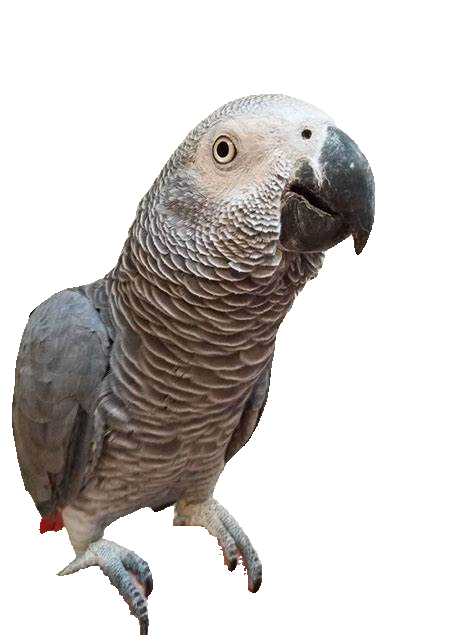

# YOLOv5 + Segment Anything Model Sticker Generator :mag::scissors:

## Description
Welcome to the YOLOv5 + Segment Anything Model project! :rocket: :sparkles: This project combines the power of the YOLOv5 object detection model with the Segment Anything Model from Meta Research to create bounding boxes, perform segmentation, and extract stickers in RGBA format from images, saving the output as PNG files. The project also includes a script that automates the process, although currently it only runs on CPU.  

## Features
:rocket: Object detection with YOLOv5
:mag: Image segmentation with Segment Anything
:art: Sticker extraction in RGBA format
:framed_picture: Automation script for easy usage
:bulb: Jupyter notebook for visualization  

## Installation and Usage
1. :fork_and_knife:  Fork the repository to your GitHub account.
2. :arrow_down: Clone the forked repository to your local machine.
3. :cd: Navigate to the local repository using the command line.
4. :computer: Run the script using the following command:  <kbd style="background-color: black; color: white; padding: 50px 75px; border-radius: 10px;">python sticker_script.py --input_image assets/dog.jpg</kbd>,  where <kbd style="background-color: black; color: white; padding: 50px 75px; border-radius: 10px;">assets/dog.jpg</kbd> is the path to the input image you want to generate stickers from.
5. :envelope: The generated stickers will be saved in the "results" folder for further usage.  

## Usage Preview
### Input image - - Output Sticker: 
  
     

## Requirements
The following dependencies are required to run the YOLOv5 and Segment Anything Sticker Generator:

1. Python 3.x
2. YOLOv5
3. Segment Anything
4. Pytorch >= 1.7
5. Torchvision >= 0.8
6. PIL (Python Imaging Library)
7. Numpy

You can install these dependencies manually using the package manager of your choice.
